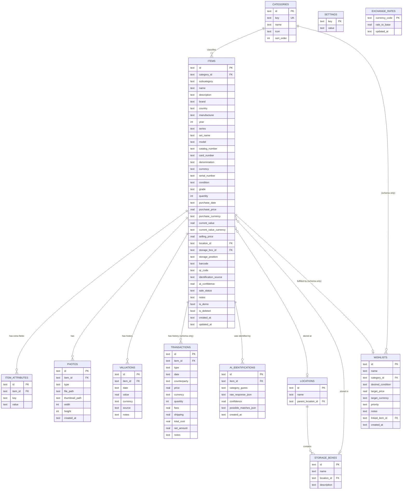

# Zora — Entity Relationship Diagram

Matches `mobile/src/db/schema.ts` exactly. Tables marked *(schema only)* exist
in the database but have no dedicated UI yet in Phase 1.

```mermaid
erDiagram
    CATEGORIES ||--o{ ITEMS : classifies
    ITEMS ||--o{ ITEM_ATTRIBUTES : "has extra fields"
    ITEMS ||--o{ PHOTOS : has
    ITEMS ||--o{ VALUATIONS : "has history"
    ITEMS ||--o{ TRANSACTIONS : "has history (schema only)"
    ITEMS ||--o{ AI_IDENTIFICATIONS : "was identified by"
    ITEMS }o--o| LOCATIONS : "stored at"
    ITEMS }o--o| STORAGE_BOXES : "stored in"
    LOCATIONS ||--o{ STORAGE_BOXES : contains
    CATEGORIES ||--o{ WISHLISTS : "(schema only)"
    ITEMS ||--o| WISHLISTS : "fulfilled by (schema only)"

    CATEGORIES {
        text id PK
        text key UK
        text name
        text icon
        int sort_order
    }

    ITEMS {
        text id PK
        text category_id FK
        text subcategory
        text name
        text description
        text brand
        text country
        text manufacturer
        int year
        text series
        text set_name
        text model
        text catalog_number
        text card_number
        text denomination
        text currency
        text serial_number
        text condition
        text grade
        int quantity
        text purchase_date
        real purchase_price
        text purchase_currency
        real current_value
        text current_value_currency
        real selling_price
        text location_id FK
        text storage_box_id FK
        text storage_position
        text barcode
        text qr_code
        text identification_source
        real ai_confidence
        text sale_status
        text notes
        bool is_demo
        bool is_deleted
        text created_at
        text updated_at
    }

    ITEM_ATTRIBUTES {
        text id PK
        text item_id FK
        text key
        text value
    }

    PHOTOS {
        text id PK
        text item_id FK
        text type
        text file_path
        text thumbnail_path
        int width
        int height
        text created_at
    }

    LOCATIONS {
        text id PK
        text name
        text parent_location_id FK
    }

    STORAGE_BOXES {
        text id PK
        text name
        text location_id FK
        text description
    }

    VALUATIONS {
        text id PK
        text item_id FK
        text date
        real value
        text currency
        text source
        text notes
    }

    TRANSACTIONS {
        text id PK
        text item_id FK
        text type
        text date
        text counterparty
        real price
        text currency
        int quantity
        real fees
        real shipping
        real total_cost
        real net_amount
        text notes
    }

    WISHLISTS {
        text id PK
        text name
        text category_id FK
        text desired_condition
        real target_price
        text target_currency
        text priority
        text notes
        text linked_item_id FK
        text created_at
    }

    AI_IDENTIFICATIONS {
        text id PK
        text item_id FK
        text category_guess
        text raw_response_json
        real confidence
        text possible_matches_json
        text created_at
    }

    SETTINGS {
        text key PK
        text value
    }

    EXCHANGE_RATES {
        text currency_code PK
        real rate_to_base
        text updated_at
    }
```
